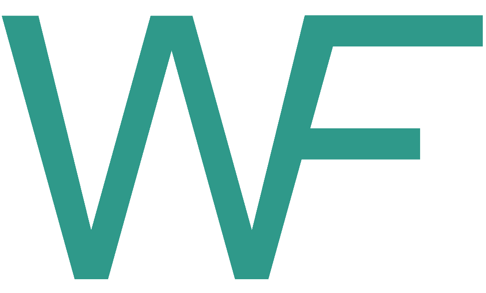

<p align="left" style="max-width: 35%;">
  
</p>

# wiff - Web Interface for FaMe

Web application built combining technologies from both gzweb (https://github.com/osrf/gzweb), for the 3d visualization of the running fame simulation, and bpmn-js-token-simulation (https://github.com/bpmn-io/bpmn-js-token-simulation), for the visualization of the BPMN diagram and of its running tokens.

(Working with Node.js 16.18.0)

## Build and Run

Build the gzweb part (you need to first install the dependencies at http://classic.gazebosim.org/tutorials?tut=gzweb_install&cat=gzweb):

(Warning: it'll download all the gazebo models locally, it may take some minutes)

```sh
source /usr/share/gazebo/setup.sh
npm run deploy --- -m
```

Then build the bpmnjs part:

```sh
npm run bundle
```

To run the application you first need to launch gzserver on a second terminal:

```sh
gzserver
```

Then start the application with:

```sh
npm start
```
